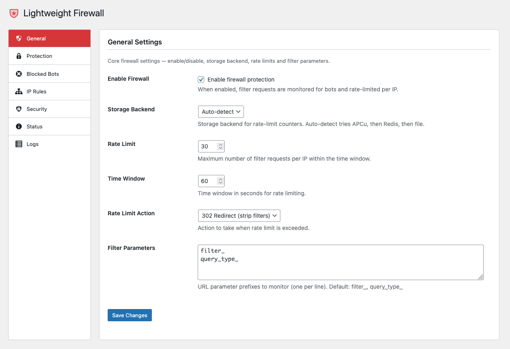

# LW Firewall

Lightweight WordPress firewall — rate-limits endpoints, blocks bots, bans repeat offenders, and adds security headers.

[](https://php.net)
[](https://wordpress.org)
[](https://www.gnu.org/licenses/gpl-2.0.html)



## The Problem

Bots brute-force `wp-login.php`, flood `wp-cron.php` and `xmlrpc.php`, crawl WooCommerce filter combinations, scan for vulnerabilities via 404s, and abuse the REST API — all generating thousands of uncacheable requests that overload your server.

## How It Works

LW Firewall installs an MU-plugin worker that intercepts requests **before WordPress fully loads**. The processing order:

1. **IP Whitelist** — whitelisted IPs skip all checks
2. **IP Blacklist** — blacklisted IPs get 403 immediately
3. **Geo Blocking** — block entire countries (Cloudflare header or CIDR lookup)
4. **Auto-Ban** — previously banned IPs get 403
5. **404 Flood** — IPs with excessive 404s get 429
6. **Bot Blocking** — User-Agent matching (all requests)
7. **Endpoint Detection** — filter params, cron, xmlrpc, login, REST API
8. **Rate Limiting** — per-IP counters with auto-ban escalation

## Features

### Endpoint Protection

| Endpoint | Protection | Response |
|----------|-----------|----------|
| WooCommerce filters | Rate limit + bot blocking | 302 redirect or 429 |
| `wp-login.php` | Brute-force rate limiting | 429 |
| `wp-cron.php` | DDoS rate limiting | 429 |
| `xmlrpc.php` | DDoS/brute-force rate limiting | 429 |
| REST API (`/wp-json/`) | Rate limiting | 429 |
| 404 flood | Vulnerability scanner blocking | 429 |

### Bot Blocking

- Block requests by User-Agent substring matching (case-insensitive)
- 20+ known bad bots blocked by default (AhrefsBot, SemrushBot, DotBot, GPTBot, etc.)
- Add/remove bot patterns via admin UI or WP-CLI

### IP Whitelist / Blacklist

- Manual IP allow/block lists
- Supports individual IPs and CIDR ranges (e.g. `192.168.1.0/24`)
- Whitelisted IPs bypass all firewall checks
- Blacklisted IPs are always blocked with 403

### Geo Blocking

- Block visitors from specific countries by ISO 3166-1 alpha-2 code (e.g. CN, RU, IN)
- **Cloudflare** — uses `CF-IPCountry` header (instant, zero-cost)
- **Without Cloudflare** — CIDR-based lookup from local cache (weekly auto-update from ipdeny.com)
- Fail-open: if no cache exists and no CF header is present, the request is not blocked
- Configurable action: 403 Forbidden or redirect to homepage
- Manual CIDR cache update via admin UI or WP-CLI

### Auto-Ban

- Automatically bans IPs that repeatedly exceed rate limits
- Configurable threshold (default: 3 violations)
- Configurable ban duration (default: 1 hour)
- Escalating protection — casual users won't trigger it, persistent attackers get banned

### Security Headers

One-click addition of security HTTP headers:

- `X-Content-Type-Options: nosniff`
- `X-Frame-Options: SAMEORIGIN`
- `Referrer-Policy: strict-origin-when-cross-origin`
- `Permissions-Policy: camera=(), microphone=(), geolocation=()`
- `X-XSS-Protection: 1; mode=block`

### Storage Backends

| Backend | Speed | Persistence | Requirement |
|---------|-------|-------------|-------------|
| **APCu** | Fastest | Per-process | `apcu` extension |
| **Redis** | Fast | Shared | `redis` extension + server |
| **File** | Fallback | Disk-based | Always available |

Auto-detection picks the best available backend.

### MU-Plugin Worker

- Loads on `muplugins_loaded` (priority 1) — before themes and plugins
- Own autoloader — zero dependency on WordPress plugin system
- Automatic install on activation, removal on deactivation
- **Auto-update** — worker file is automatically replaced when its version doesn't match the plugin version

### Cloudflare Support

- Automatic real IP detection via `CF-Connecting-IP` header
- Cloudflare IP range validation to prevent header spoofing

### Request Logging

- Optional logging of all blocked requests (time, IP, reason, User-Agent, URL)
- Admin log viewer with table display
- One-click log clearing

## Installation

**Via Composer:**

```bash
composer require lwplugins/lw-firewall
```

**Manual:**

1. Download the latest release ZIP
2. Upload to `/wp-content/plugins/`
3. Activate in WordPress admin

## Settings

Navigate to **LW Plugins > Firewall** in the admin panel.

| Tab | Description |
|-----|-------------|
| **General** | Enable/disable, storage backend, rate limit, time window, action, filter params |
| **Protection** | Endpoint toggles (cron, xmlrpc, login, REST API, 404) and auto-ban settings |
| **Bots** | Manage blocked bot User-Agent patterns |
| **IP Rules** | IP whitelist and blacklist (IPs and CIDR ranges) |
| **Geo Blocking** | Country-based blocking with Cloudflare or CIDR fallback |
| **Security** | HTTP security headers toggle |
| **Status** | MU-plugin worker status, worker version, active storage backend, reinstall worker |
| **Logs** | Enable logging, view blocked requests, clear log |
| **Import / Export** | Export settings as JSON, import on another site |

## WP-CLI Commands

```bash
# Show firewall status overview
wp lw-firewall status

# Configuration
wp lw-firewall config list
wp lw-firewall config set rate_limit 50
wp lw-firewall config set storage redis
wp lw-firewall config set protect_login true
wp lw-firewall config set auto_ban_enabled true
wp lw-firewall config reset --yes

# Bot management
wp lw-firewall bots list
wp lw-firewall bots add "BadBot/1.0"
wp lw-firewall bots remove "BadBot/1.0"

# IP whitelist / blacklist
wp lw-firewall ip list whitelist
wp lw-firewall ip list blacklist
wp lw-firewall ip add whitelist 192.168.1.100
wp lw-firewall ip add blacklist 10.0.0.0/8
wp lw-firewall ip remove whitelist 192.168.1.100

# Geo blocking
wp lw-firewall geo list
wp lw-firewall geo add CN
wp lw-firewall geo remove CN
wp lw-firewall geo update

# Log management
wp lw-firewall logs list --limit=50
wp lw-firewall logs clear --yes

# MU-plugin worker
wp lw-firewall worker install
wp lw-firewall worker remove
```

## wp-config.php Overrides

Override any setting via constants (takes precedence over admin UI):

```php
define( 'LW_FIREWALL_ENABLED', true );
define( 'LW_FIREWALL_STORAGE', 'apcu' );            // apcu, redis, file
define( 'LW_FIREWALL_RATE_LIMIT', 30 );
define( 'LW_FIREWALL_RATE_WINDOW', 60 );             // seconds
define( 'LW_FIREWALL_ACTION', '429' );                // 429 or redirect
define( 'LW_FIREWALL_PROTECT_CRON', true );
define( 'LW_FIREWALL_PROTECT_XMLRPC', true );
define( 'LW_FIREWALL_PROTECT_LOGIN', true );
define( 'LW_FIREWALL_PROTECT_REST_API', false );
define( 'LW_FIREWALL_PROTECT_404', false );
define( 'LW_FIREWALL_AUTO_BAN_ENABLED', true );
define( 'LW_FIREWALL_AUTO_BAN_THRESHOLD', 3 );
define( 'LW_FIREWALL_AUTO_BAN_DURATION', 3600 );     // seconds
define( 'LW_FIREWALL_SECURITY_HEADERS', true );
define( 'LW_FIREWALL_LOG_ENABLED', false );
define( 'LW_FIREWALL_GEO_ENABLED', true );
```

## Requirements

- PHP 8.1 or higher
- WordPress 6.0 or higher

## Part of LW Plugins

LW Firewall is part of the [LW Plugins](https://github.com/lwplugins) family — lightweight WordPress plugins with minimal footprint and maximum impact.

| Plugin | Description |
|--------|-------------|
| [LW SEO](https://github.com/lwplugins/lw-seo) | Essential SEO features without the bloat |
| [LW Disable](https://github.com/lwplugins/lw-disable) | Disable WordPress features |
| [LW Enable](https://github.com/lwplugins/lw-enable) | Enable WordPress features like SVG uploads |
| [LW ZenAdmin](https://github.com/lwplugins/lw-zenadmin) | Clean up your admin — notices sidebar & widget manager |
| **LW Firewall** | Lightweight firewall — rate limiting, bot blocking, auto-ban |
| [LW Cookie](https://github.com/lwplugins/lw-cookie) | GDPR-compliant cookie consent |
| [LW LMS](https://github.com/lwplugins/lw-lms) | Lightweight LMS — courses, lessons, progress tracking |
| [LW Translate](https://github.com/lwplugins/lw-translate) | Manage community translations from GitHub |
| [LW Site Manager](https://github.com/lwplugins/lw-site-manager) | Site maintenance via AI/REST using Abilities API |

## License

GPL-2.0-or-later. See [LICENSE](https://www.gnu.org/licenses/gpl-2.0.html) for details.

## Contributing

Contributions are welcome! Please feel free to submit a Pull Request.
