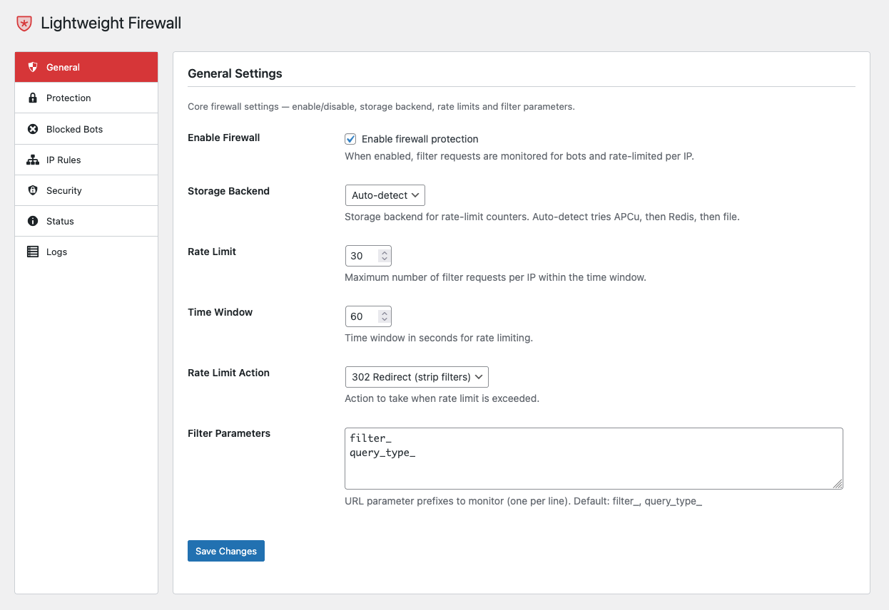

# LW Firewall

Lightweight WordPress firewall — rate-limits endpoints, blocks bots, bans repeat offenders, and adds security headers.

[](https://php.net)
[](https://wordpress.org)
[](https://www.gnu.org/licenses/gpl-2.0.html)



## The Problem

Bots brute-force `wp-login.php`, flood `wp-cron.php` and `xmlrpc.php`, crawl WooCommerce filter combinations, scan for vulnerabilities via 404s, and abuse the REST API — all generating thousands of uncacheable requests that overload your server.

## How It Works

LW Firewall installs an MU-plugin worker that intercepts requests **before WordPress fully loads**. The processing order:

1. **IP Whitelist** — whitelisted IPs skip all checks
2. **IP Blacklist** — blacklisted IPs get 403 immediately
3. **Geo Blocking** — block entire countries (Cloudflare header or CIDR lookup)
4. **Auto-Ban** — previously banned IPs get 403
5. **404 Flood** — IPs with excessive 404s get 429
6. **Bot Blocking** — User-Agent matching (all requests)
7. **Endpoint Detection** — filter params, cron, xmlrpc, login, REST API
8. **Rate Limiting** — per-IP counters with auto-ban escalation

That list is the worker's pre-WordPress path. Registration spam protection, password-reset flood protection and the administrator alerts run inside WordPress instead, because they need the user API — but they share the same storage backend and ban store, so an IP banned by any of them is blocked by the worker on its next request.

## Features

### Endpoint Protection

| Endpoint | Protection | Response |
|----------|-----------|----------|
| WooCommerce filters | Rate limit + bot blocking | 302 redirect or 429 |
| `wp-login.php` | Brute-force rate limiting | 429 |
| `wp-cron.php` | DDoS rate limiting | 429 |
| `xmlrpc.php` | DDoS/brute-force rate limiting | 429 |
| REST API (`/wp-json/`) | Rate limiting | 429 |
| 404 flood | Vulnerability scanner blocking | 429 |

### Bot Blocking

- Block requests by User-Agent substring matching (case-insensitive)
- 14 scraper and training crawlers blocked by default (AhrefsBot, SemrushBot, DotBot, GPTBot, Bytespider, etc.)
- AI agents that fetch a page for a real visitor or cite it with a link (ChatGPT-User, OAI-SearchBot, ClaudeBot, PerplexityBot, Meta-ExternalFetcher) are deliberately **not** blocked
- Add/remove bot patterns via admin UI or WP-CLI

### IP Whitelist / Blacklist

- Manual IP allow/block lists
- Supports individual IPs and CIDR ranges (e.g. `192.168.1.0/24`)
- Whitelisted IPs bypass all firewall checks
- Blacklisted IPs are always blocked with 403

### Geo Blocking

- Block visitors from specific countries by ISO 3166-1 alpha-2 code (e.g. CN, RU, IN)
- **Cloudflare** — uses `CF-IPCountry` header (instant, zero-cost)
- **Without Cloudflare** — CIDR-based lookup from local cache (weekly auto-update from ipdeny.com)
- Fail-open: if no cache exists and no CF header is present, the request is not blocked
- Configurable action: 403 Forbidden or redirect to homepage
- Manual CIDR cache update via admin UI or WP-CLI

### Auto-Ban

- Automatically bans IPs that repeatedly exceed rate limits
- Configurable threshold (default: 3 violations)
- Configurable ban duration (default: 1 hour)
- Escalating protection — casual users won't trigger it, persistent attackers get banned
- Bans are listable and liftable from the IP Rules tab or WP-CLI, and record why they happened (failed logins, registration spam, password-reset flood, rate limit)
- Lifting a ban clears the counters behind it, so the address is not re-banned on its next request

### Brute-Force Login Lockout

Counts failed logins per IP and bans the address once the threshold is reached inside the window. Off by default — enable it with `login_limit_enabled`.

| Setting | Default | Meaning |
|---------|---------|---------|
| `login_max_attempts` | 5 | Failures before the ban |
| `login_lockout_window` | 600 | Seconds the failures are counted over |
| `login_lockout_duration` | 3600 | How long the ban lasts |

The ban is written to the shared ban store, so the MU-plugin worker blocks the address **site-wide** on its next request, not just on the login form. Whitelisted IPs are checked first and bypass it entirely.

### Registration Spam Protection

Blocks bot sign-ups on `wp-login.php?action=register` without a captcha:

- Signed proof-of-render token — a direct POST that never loaded the form is rejected
- Hidden honeypot field, invisible to real users
- Minimum fill time, so instant bot submissions are refused
- Single-use tokens, so one rendered form can register only once
- Auto-ban for IPs that repeatedly submit spam registrations

### Password Reset Flood Protection

Hooked on `lostpassword_post` — the one chokepoint both WordPress core and WooCommerce's own my-account form pass through, so `wp-login.php?action=lostpassword` and the WooCommerce "Lost your password?" form are covered by the same rules.

A reset flood has three shapes, so there are three independent limits:

| Limit | Default | What it stops |
|-------|---------|---------------|
| Per IP | 5 / 15 min | One host hammering the form |
| **Per target account** | 3 / hour | Many hosts flooding **one person's inbox** — per-IP limiting cannot see this |
| Site-wide | 30 / hour | Total reset emails per hour; protects your mail quota and your domain's sending reputation |

The per-account counter is keyed by user ID, so `admin`, `Admin` and the account's email address share one bucket. Once an IP is over its own limit the request is refused *without* touching the target counter, so an attacker cannot use their own flood to lock the victim out of a genuine reset.

Also included:

- Proof-of-render token and honeypot on the wp-login form, with its own fill time, lifetime and single-use settings (enforced only there — other lost-password forms never render the token; the rate limits apply everywhere)
- Optional auto-ban for IPs that trip the per-IP limit or fail the token check. Account and site-wide limits never ban — they say nothing about who happened to ask last
- Optional hardening that takes administrator accounts out of the reset flow entirely
- Optional email alert when a limit is reached, throttled to one message per limit per hour
- Requests started by a user with `edit_users` or by WP-CLI bypass every check, so the Users screen "Send password reset link" keeps working during a flood

### New Administrator Alerts

Email notification whenever an account gains administrator privileges, or an existing administrator account is modified — no matter how it happened. Two detection paths, because neither is complete alone:

| Path | Catches | Latency |
|------|---------|---------|
| Core hooks | Anything going through the WordPress user API — admin screens, plugins, REST, WP-CLI. Reports the acting user and their IP | Immediate |
| Hourly reconciliation scan | A direct database write, code bypassing the user API, or changes made while the plugin was inactive | Within the hour |

The stored snapshot fingerprints each administrator (user ID, username, email address, and a digest of the stored password hash), so a **takeover** is caught too: rewriting an admin's email address hands the attacker the password reset flow while the user ID stays the same, which an ID-only comparison would never see. The digest only answers "did this change?" — no password or usable hash is stored, and none is ever printed in an alert.

Both paths write to the same snapshot, so one event produces one alert. Existing administrators are recorded silently when the feature is enabled, so upgrading sites are never mailed about accounts they already had.

### Security Headers

One-click addition of security HTTP headers:

- `X-Content-Type-Options: nosniff`
- `X-Frame-Options: SAMEORIGIN`
- `Referrer-Policy: strict-origin-when-cross-origin`
- `Permissions-Policy: camera=(), microphone=(), geolocation=()`

### Storage Backends

| Backend | Speed | Persistence | Requirement |
|---------|-------|-------------|-------------|
| **APCu** | Fastest | Per-process | `apcu` extension |
| **Redis** | Fast | Shared | `redis` extension + server |
| **File** | Fallback | Disk-based | Always available |

Auto-detection picks the best available backend.

### MU-Plugin Worker

- Loads on `muplugins_loaded` (priority 1) — before themes and plugins
- Own autoloader — zero dependency on WordPress plugin system
- Automatic install on activation, removal on deactivation
- **Auto-update** — worker file is automatically replaced when its version doesn't match the plugin version

### Cloudflare Support

- Automatic real IP detection via `CF-Connecting-IP` header
- Cloudflare IP range validation to prevent header spoofing
- The `CF-IPCountry` header used for geo blocking clears the same trust test

### Reverse Proxy Support

Behind a proxy or load balancer every request arrives with the proxy's address, so without configuration the whole internet shares one rate-limit bucket, one ban and one country. On the common "nginx in front of Apache on the same host" layout that address is `127.0.0.1`.

List your own proxies under **IP Rules → Reverse Proxy**. The forwarded chain is then read right to left, skipping hops that are themselves trusted, and the first address you do not vouch for is the client.

This is opt-in on purpose: a forwarded header is written by the client until the hop that set it is known, so trusting one by default would let any visitor pick their own IP. The **Status** tab warns when the address the firewall sees is not routable on the internet.

### Request Logging

- Optional logging of all blocked requests (time, IP, reason, User-Agent, URL)
- Admin log viewer with table display
- One-click log clearing

## Installation

**Via Composer:**

```bash
composer require lwplugins/lw-firewall
```

**Manual:**

1. Download the latest release ZIP
2. Upload to `/wp-content/plugins/`
3. Activate in WordPress admin

## Settings

Navigate to **LW Plugins > Firewall** in the admin panel.

| Tab | Description |
|-----|-------------|
| **General** | Enable/disable, storage backend, rate limit, time window, action, filter params |
| **Protection** | Endpoint toggles (cron, xmlrpc, login, REST API, 404) and auto-ban settings |
| **Bots** | Manage blocked bot User-Agent patterns |
| **IP Rules** | IP whitelist and blacklist (IPs and CIDR ranges), trusted reverse proxies, plus the automatic-ban table with per-row unblock |
| **Spam** | Registration spam protection and password-reset flood protection |
| **Geo Blocking** | Country-based blocking with Cloudflare or CIDR fallback |
| **Security** | HTTP security headers toggle |
| **Alerts** | New-administrator and account-takeover email alerts, recipients, scan schedule |
| **Status** | MU-plugin worker status, worker version, active storage backend, reinstall worker |
| **Logs** | Enable logging, view blocked requests, clear log |
| **Import / Export** | Export settings as JSON, import on another site |

## WP-CLI Commands

All 31 commands are listed below. `--format` accepts `table` (default), `json`, `csv` or `yaml`.

### Status

```bash
wp lw-firewall status
```

### Configuration

`config` reads and writes whole values; `config-items` edits a single entry of a list setting without resending the whole list.

```bash
wp lw-firewall config list [--format=<format>]
wp lw-firewall config get <key> [--format=<format>]
wp lw-firewall config set <key> <value>
wp lw-firewall config reset [--yes]

wp lw-firewall config-items add <key> <entry>
wp lw-firewall config-items remove <key> <entry>
```

```bash
# Examples
wp lw-firewall config set rate_limit 50
wp lw-firewall config set storage redis
wp lw-firewall config set protect_login true
wp lw-firewall config set filter_params "filter_|30,add-to-cart|10"
wp lw-firewall config-items add blocked_countries KP
wp lw-firewall config-items remove ip_blacklist 203.0.113.42
```

### Bots

```bash
wp lw-firewall bots list [--format=<format>]
wp lw-firewall bots add <user_agent>
wp lw-firewall bots remove <user_agent>
```

### IP whitelist / blacklist

```bash
wp lw-firewall ip list <whitelist|blacklist> [--format=<format>]
wp lw-firewall ip add <whitelist|blacklist> <ip>
wp lw-firewall ip remove <whitelist|blacklist> <ip>
```

```bash
# Examples
wp lw-firewall ip add whitelist 192.168.1.100
wp lw-firewall ip add blacklist 10.0.0.0/8
```

### Geo blocking

```bash
wp lw-firewall geo list [--format=<format>]
wp lw-firewall geo add <code>
wp lw-firewall geo remove <code>
wp lw-firewall geo update          # refresh the cached CIDR lists now
```

### New-administrator alerts

```bash
wp lw-firewall alerts status [--format=<format>]
wp lw-firewall alerts scan                  # run the reconciliation scan now
wp lw-firewall alerts test                  # send a test alert to the recipients
wp lw-firewall alerts baseline              # show the known-administrator snapshot
wp lw-firewall alerts baseline --reset      # re-take the snapshot from the live list
```

`alerts scan` also lets sites with WP-Cron disabled drive the scan from a system cron.

### Password reset flood protection

```bash
wp lw-firewall reset status [--format=<format>]   # settings plus the option key behind each
wp lw-firewall reset on [--proof] [--auto-ban] [--alert] [--block-admins]
wp lw-firewall reset off                          # limits are kept, so `on` restores them
```

| Flag | Effect |
|------|--------|
| `--proof` | Require the proof-of-render token on the wp-login form |
| `--auto-ban` | Ban IPs that trip the per-IP limit or fail the token check |
| `--alert` | Email the Alerts-tab recipients when a limit is reached |
| `--block-admins` | Refuse password resets for administrator accounts entirely — recovery then needs WP-CLI or another administrator |

### Automatic bans

```bash
wp lw-firewall ban list [--format=<format>]   # who is banned, why, until when
wp lw-firewall ban check <ip>                 # is this address banned?
wp lw-firewall ban remove <ip>                # lift one ban
wp lw-firewall ban clear [--yes]              # lift every tracked ban
```

`ban remove` also clears the counters that produced the ban — rate-limit, failed-login, registration, password-reset and 404 — so the address starts from zero instead of being re-banned on its next request. The `active` column in `ban list` reconciles the index against the storage backend: `no` means the entry is tracked but no longer enforced, which happens after a Redis flush or an APCu restart.

The same table, with an Unblock button per row, is on the **IP Rules** settings tab.

### Logs

```bash
wp lw-firewall logs list [--limit=<n>] [--format=<format>]
wp lw-firewall logs clear [--yes]
```

### MU-plugin worker

```bash
wp lw-firewall worker install
wp lw-firewall worker remove
```

## wp-config.php Overrides

Every setting can be overridden by a constant named `LW_FIREWALL_` + the option key in uppercase. A constant always wins over the admin UI and WP-CLI, and the settings screen lists the options a constant has pinned so a locked field is visibly locked.

> Before 1.5.5 the constants applied to single option reads but not to the worker, the runtime hooks or the .htaccess sync. Upgrade if you rely on them.

```php
// Reverse proxy — leave unset unless the site is behind one. Cloudflare is
// detected automatically and needs nothing here.
define( 'LW_FIREWALL_TRUSTED_PROXIES', [ '127.0.0.1' ] );
define( 'LW_FIREWALL_PROXY_HEADER', 'x-forwarded-for' );  // or x-real-ip, forwarded

// Core
define( 'LW_FIREWALL_ENABLED', true );
define( 'LW_FIREWALL_STORAGE', 'apcu' );                 // auto, apcu, redis, file
define( 'LW_FIREWALL_RATE_LIMIT', 30 );
define( 'LW_FIREWALL_RATE_WINDOW', 60 );                 // seconds
define( 'LW_FIREWALL_ACTION', '429' );                   // 429 or redirect
define( 'LW_FIREWALL_LOG_ENABLED', false );

// Endpoint protection
define( 'LW_FIREWALL_PROTECT_CRON', true );
define( 'LW_FIREWALL_PROTECT_XMLRPC', true );
define( 'LW_FIREWALL_PROTECT_LOGIN', true );
define( 'LW_FIREWALL_PROTECT_REST_API', false );
define( 'LW_FIREWALL_PROTECT_404', false );

// Auto-ban
define( 'LW_FIREWALL_AUTO_BAN_ENABLED', true );
define( 'LW_FIREWALL_AUTO_BAN_THRESHOLD', 3 );
define( 'LW_FIREWALL_AUTO_BAN_DURATION', 3600 );         // seconds

// Brute-force login lockout
define( 'LW_FIREWALL_LOGIN_LIMIT_ENABLED', false );
define( 'LW_FIREWALL_LOGIN_MAX_ATTEMPTS', 5 );
define( 'LW_FIREWALL_LOGIN_LOCKOUT_WINDOW', 600 );       // seconds
define( 'LW_FIREWALL_LOGIN_LOCKOUT_DURATION', 3600 );    // seconds

// Registration spam protection
define( 'LW_FIREWALL_REGISTER_PROTECT_ENABLED', true );
define( 'LW_FIREWALL_REGISTER_HONEYPOT', true );
define( 'LW_FIREWALL_REGISTER_SINGLE_USE', true );
define( 'LW_FIREWALL_REGISTER_MIN_FILL_TIME', 2 );       // seconds
define( 'LW_FIREWALL_REGISTER_TOKEN_MAX_AGE', 3600 );    // seconds
define( 'LW_FIREWALL_REGISTER_BAN_THRESHOLD', 3 );
define( 'LW_FIREWALL_REGISTER_BAN_DURATION', 3600 );     // seconds

// Password reset flood protection
define( 'LW_FIREWALL_RESET_PROTECT_ENABLED', true );
define( 'LW_FIREWALL_RESET_IP_MAX', 5 );                 // 0 disables this axis
define( 'LW_FIREWALL_RESET_IP_WINDOW', 900 );            // seconds
define( 'LW_FIREWALL_RESET_USER_MAX', 3 );               // 0 disables this axis
define( 'LW_FIREWALL_RESET_USER_WINDOW', 3600 );         // seconds
define( 'LW_FIREWALL_RESET_GLOBAL_MAX', 30 );            // per hour, 0 disables
define( 'LW_FIREWALL_RESET_PROOF_ENABLED', true );
define( 'LW_FIREWALL_RESET_MIN_FILL_TIME', 2 );          // seconds
define( 'LW_FIREWALL_RESET_TOKEN_MAX_AGE', 3600 );       // seconds
define( 'LW_FIREWALL_RESET_SINGLE_USE', true );
define( 'LW_FIREWALL_RESET_AUTO_BAN', false );
define( 'LW_FIREWALL_RESET_BAN_DURATION', 3600 );        // seconds
define( 'LW_FIREWALL_RESET_BLOCK_ADMINS', false );
define( 'LW_FIREWALL_RESET_ALERT_ENABLED', false );

// New-administrator alerts
define( 'LW_FIREWALL_ADMIN_ALERT_ENABLED', false );
define( 'LW_FIREWALL_ADMIN_ALERT_EMAIL', 'security@example.com' );  // empty = site admin email
define( 'LW_FIREWALL_ADMIN_ALERT_SCAN_ENABLED', true );
define( 'LW_FIREWALL_ADMIN_ALERT_CHANGES', true );

// Security headers and geo blocking
define( 'LW_FIREWALL_SECURITY_HEADERS', true );
define( 'LW_FIREWALL_GEO_ENABLED', true );

// Emergency kill-switch for the MU-plugin worker
define( 'LW_FIREWALL_DISABLE_WORKER', true );
```

The list settings (`ip_whitelist`, `ip_blacklist`, `blocked_bots`, `filter_params`, `blocked_countries`) accept constants too, as arrays — but they are usually easier to manage with `wp lw-firewall config-items` or the admin UI:

```php
define( 'LW_FIREWALL_IP_WHITELIST', [ '192.168.1.100', '10.0.0.0/8' ] );
```

## Requirements

- PHP 8.2 or higher
- WordPress 6.0 or higher

## Part of LW Plugins

LW Firewall is part of the [LW Plugins](https://github.com/lwplugins) family — lightweight WordPress plugins with minimal footprint and maximum impact.

| Plugin | Description |
|--------|-------------|
| [LW SEO](https://github.com/lwplugins/lw-seo) | Essential SEO features without the bloat |
| [LW Disable](https://github.com/lwplugins/lw-disable) | Disable WordPress features |
| [LW Enable](https://github.com/lwplugins/lw-enable) | Enable WordPress features like SVG uploads |
| [LW ZenAdmin](https://github.com/lwplugins/lw-zenadmin) | Clean up your admin — notices sidebar & widget manager |
| **LW Firewall** | Lightweight firewall — rate limiting, bot blocking, auto-ban |
| [LW Cookie](https://github.com/lwplugins/lw-cookie) | GDPR-compliant cookie consent |
| [LW LMS](https://github.com/lwplugins/lw-lms) | Lightweight LMS — courses, lessons, progress tracking |
| [LW Translate](https://github.com/lwplugins/lw-translate) | Manage community translations from GitHub |
| [LW Site Manager](https://github.com/lwplugins/lw-site-manager) | Site maintenance via AI/REST using Abilities API |

## License

GPL-2.0-or-later. See [LICENSE](https://www.gnu.org/licenses/gpl-2.0.html) for details.

## Contributing

Contributions are welcome! Please feel free to submit a Pull Request.


## Sponsor

<a href="https://sinann.io/">
  
</a>

Supported by [Sinann](https://sinann.io/)
